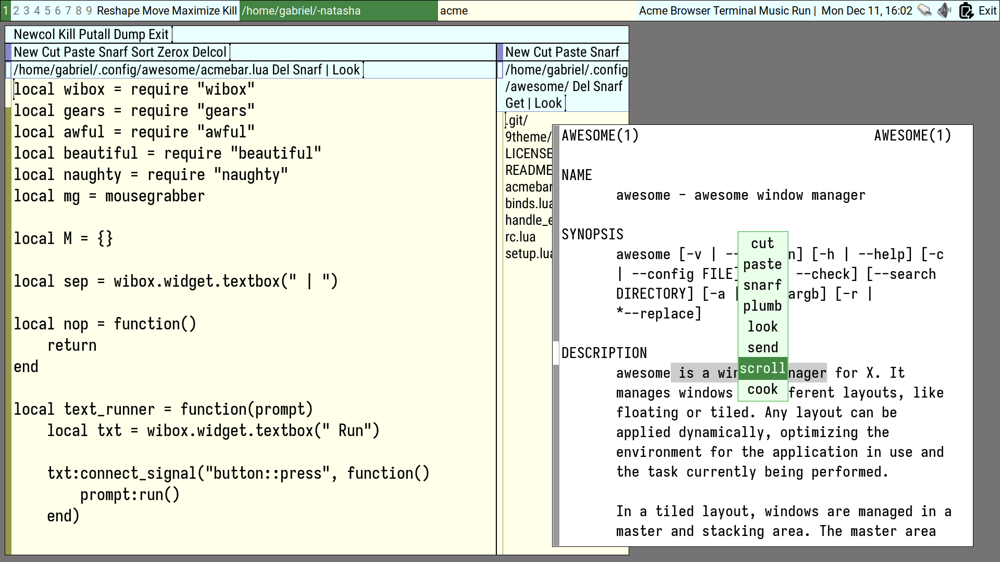

# 9awesome

Plan 9 inspired [Awesome](https://github.com/awesomeWM/awesome) configuration.

The workflow is mostly inspired by Acme and Sam, while keeping some ideas from
Rio.

It's really not possible to recreate the Rio workflow perfectly in X.org, and I
couldn't find a way to create the select-window feature that most Rio commands
use before executing. So I found a cozy middle-term between the Acme windowing
management, Awesome itself and Rio.

Currently if you want to use this you would like to go and personalize the
launchers in `acmebar.lua` and the variables in `rc.lua`.

TODO:  
- Generalize stuff like fonts and maybe keybinds. Maybe read a file from the 
  user's home so Awesome is completely transparent?  

## General usage

- The window manager is click-to-type, i.e., the focus does not follows the
  mouse. As you need to get the mouse up in the bar to operate in the currently
  focused window, focus-follows-mouse would be a pain to work with;  
- Tag-keybinds with Super and Super-Shift works;  
- Moving and Reshaping with Super and Super-Shift and the mouse works;  
- There are a few keybinds in `binds.lua` but the configuration is meant to be
  mouse-driven;
- Clicking with button 1 in a tag shows only it, button 2 toggles it and button
  3 sends the current focused window to it;  
- Clicking with button 1 in the tasklist just switches between windows. Nothing
  more;  
- Clicking any button in the Acme-like launchers launch it. The launchers at the
  right of the taglist are for window-management. The launchers at the right of
  the tasklist are for launching programs. The `Run` launcher is special: it
  toggles an Awesome prompt to run any command;  
- At the right of the programs launchers, there's a clock, the system tray and a 
  launcher for exiting Awesome.

## Reshaping

When toggling the reshape launcher, use the mouse to draw the new shape of the
window with button 1. A dumb window will be shown helping you with that. Buttons 
2 and 3 cancels the operation. Trying to reshape to less than 50x50 pixels will
fail (by design, so I don't accidentaly reshape windows to stupid sizes. You
may change the value in the function `doreshape` at `acmebar.lua`). Trying to
reshape to less than the window's minimum size hint will work but the window
will be set to it's minimum size.

## Moving

When toggling the move launcher, a dumb window will show you the new position of
the moved window. Move the mouse around to change it. Use button 1 to confirm,
or button 2 or 3 to cancel the operation.

## Maximize

The maximize launcher just toggles the maximization state of the window, nothing
special with it.

## Killing windows and exiting Awesome

Both the kill launcher and the exit launcher will ask for confirmation. Use the
button 1 to confirm the operation or buttons 2 or 3 to cancel it.
